<div dir="rtl" align="right">

<p align="center">
  
</p>

# WDSteamFx


محول أسعار **Steam** إلى **العملات الخليجية**.


## 💱 العملات المدعومة

**يتعرّف على الأسعار بهذه العملات:**

- 🇺🇦 الهريفنيا الأوكرانية (UAH)

- 🇹🇷 الليرة التركية (TRY)

- 🇦🇷 البيزو الأرجنتيني (ARS)

- 🇨🇳 اليوان الصيني (CNY)

- 🇵🇰 الروبية الباكستانية (PKR)

- 🇮🇳 الروبية الهندية (INR)

- 🇪🇺 اليورو (EUR)

- 🇬🇧 الجنيه الإسترليني (GBP)

- 🇺🇸 الدولار الأمريكي (USD)

**ويحوّلها إلى العملة اللي تختارها:**

- 🇸🇦 الريال السعودي (SAR)

- 🇦🇪 الدرهم الإماراتي (AED)

- 🇶🇦 الريال القطري (QAR)

- 🇰🇼 الدينار الكويتي (KWD)

- 🇧🇭 الدينار البحريني (BHD)

- 🇴🇲 الريال العُماني (OMR)

## 🖥️ المنصات

- 🌐 متصفح Chrome والمتصفحات المبنية على Chromium.

-  Tampermonkey🐵

- 🖥️ يعمل مع برنامج Steam عبر Millennium Installer.
---

## ✨ المميزات

- لوحة تحكم عائمة داخل صفحات Steam لاختيار عملة التحويل بضغطة واحدة.

- واجهة بلغتين: العربية والإنجليزية مع تبديل فوري.

- تحديث أسعار الصرف تلقائياً كل 24 ساعة، مع زر تحديث يدوي في أي وقت.

- ثلاثة مصادر لأسعار الصرف، وإذا تعطّل أحدها ينتقل للتالي تلقائياً.

- عرض آخر وقت تحديث ومصدر السعر داخل اللوحة.

- خيار تثبيت اللون الأخضر الأصلي لستيم على السعر المحوّل.

- الدينار الكويتي والبحريني والعُماني بثلاث خانات عشرية.

- تجاهل الأسعار المشطوبة أثناء التخفيضات.

- اكتشاف الأسعار الجديدة تلقائياً أثناء تصفح Steam.

- خفيفة وسريعة ولا تؤثر على أداء Steam.

---


## 📸 صور من الإضافة


<p align="center">
  
  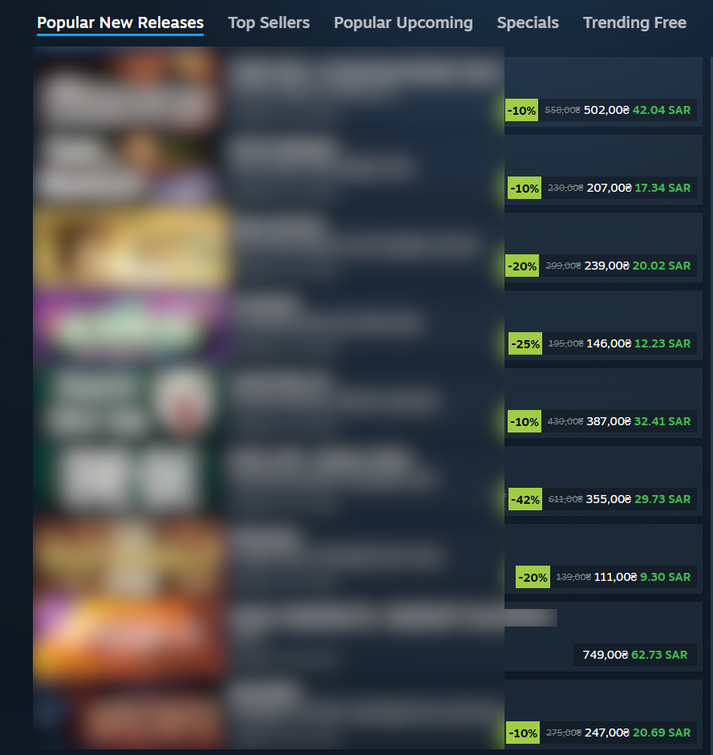
  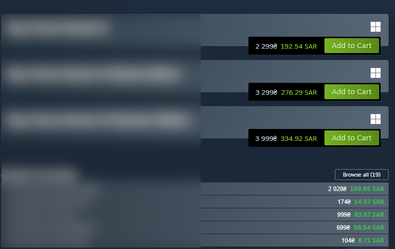
   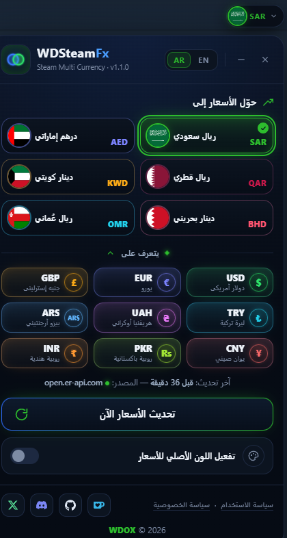
 
</p>


---

# 📥 التثبيت

## إضافة Chrome

1. حمّل المشروع أو انسخه.

2. افتح صفحة الإضافات:

   ```
   chrome://extensions
   ```

3. فعّل **وضع المطور (Developer Mode)**.

4. اضغط **تحميل إضافة غير معبأة (Load unpacked)**.

5. اختر مجلد المشروع.

---

## Tampermonkey

1. ثبّت إضافة **Tampermonkey**.

2. استورد ملف **WDSteamFx-Tampermonkey**.

3. افتح أي صفحة في Steam وسيعمل السكربت تلقائياً.

---

## عميل Steam (Millennium Installer)

إذا كنت ترغب باستخدام WDSteam داخل **برنامج Steam نفسه** بدلاً من المتصفح، اتبع الخطوات التالية:

1. ثبّت **Millennium Installer** على جهازك.

2. افتح إعدادات Millennium.

3. ثبّت إضافة **Extensions**.

4. أدخل الكود التالي:

   ```
   788ed8554492
   ```

5. بعد تثبيت إضافة **Extensions**، ثبّت WDSteam وسيعمل داخل عميل Steam مباشرة.


<p align="center">
  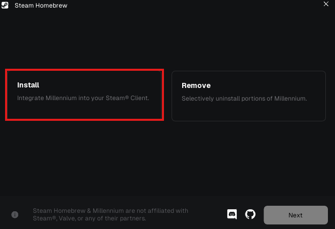
  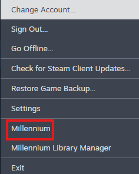
  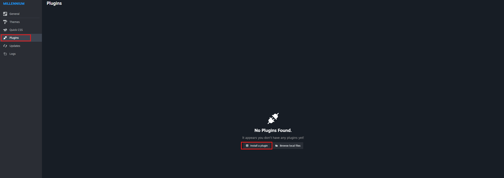
  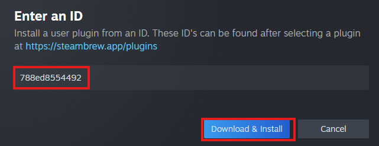
  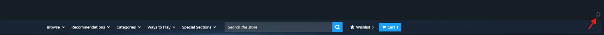
  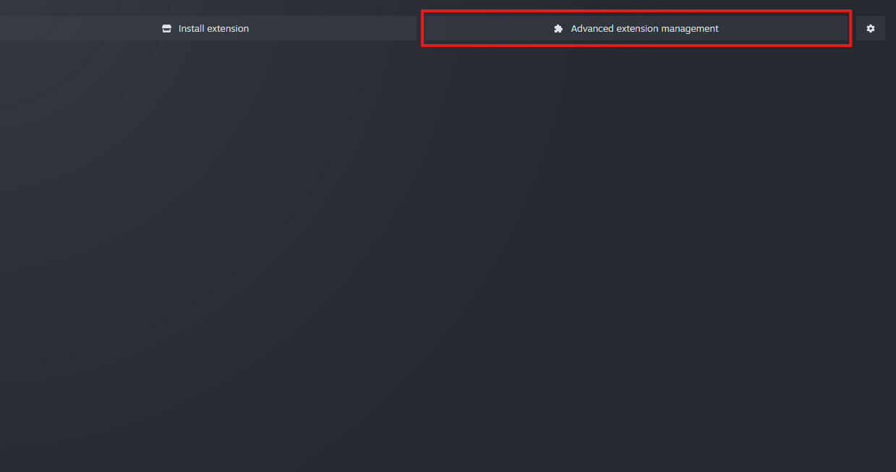
  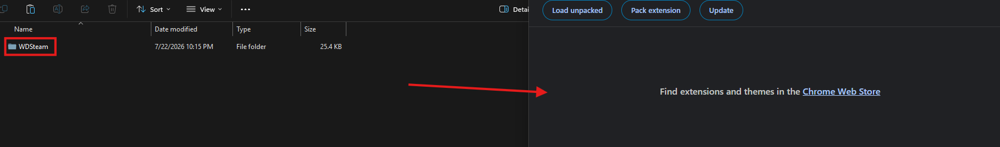
  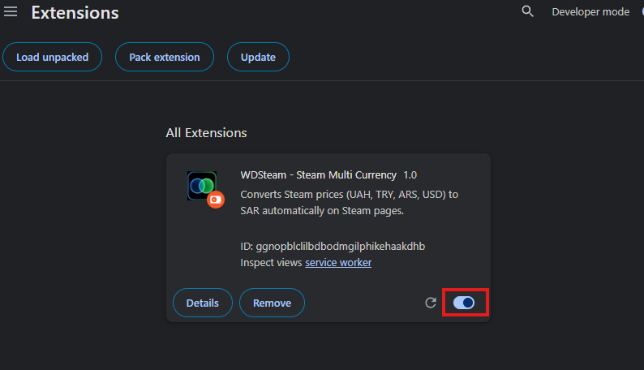
</p>

> الصور أعلاه توضح خطوات تثبيت إضافة **Extensions** داخل إعدادات Millennium وإدخال الكود `788ed8554492`.

---

# 🚀 الاستخدام

بمجرد زيارة أي صفحة في متجر Steam أو صفحات المجتمع التي تحتوي على أسعار بإحدى العملات المدعومة، ستظهر القيمة المقابلة بالعملة المختارة بجانب السعر الأصلي تلقائياً.

لتغيير العملة، اضغط الزر العائم في أعلى يمين الصفحة واختر العملة اللي تبيها، وراح تتحدث كل الأسعار بالصفحة مباشرة. اختيارك يُحفظ محلياً في متصفحك.

---

# 🔐 الصلاحيات

تستخدم الإضافة الصلاحيات التالية فقط:

- `storage`

- `alarms`

- الوصول إلى `open.er-api.com` و `api.exchangerate.fun` و `hexarate.paikama.co` لجلب أسعار الصرف.

> **لا تقوم الإضافة بجمع أو إرسال أي بيانات شخصية.**

---

# 📄 سياسة الخصوصية

راجع ملف:

`PRIVACY_POLICY.md`

---

# ⚖️ الترخيص

هذا المشروع مرخص بموجب **MIT License**.

راجع ملف:

`LICENSE`

---

# 👨‍💻 المطورين

<table align="center">
  <tr>
    <td align="center">
      <a href="https://gist.github.com/BAKHSHAWI999">
        
        <br/>
        <b>BAKHSHAWI999</b>
      </a>
      <br/>
      الفكرة والنسخة الأولى
    </td>
    <td align="center">
      <a href="https://gist.github.com/DevWD7">
        
        <br/>
        <b>WDOX</b>
      </a>
      <br/>
      التطوير والتحديث الحالي
    </td>
  </tr>
</table>

</div>
